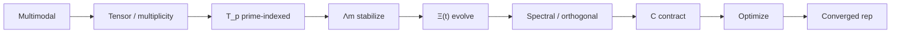

<!--
  Copyright (C) 2026 HCALC contributors
  SPDX-License-Identifier: AGPL-3.0-only
-->

# HCALC — Mathematical Research Center

**Purpose.** Establish mathematical coherence for the HCALC abstract dynamics

\[
X_{t+1} = \Xi(t,\; \Lambda_m \cdot C[T_p(X_t)])
\]

and relate (without equating) Foundry J’s additive Banach step (PROPERTIES **39**) via an explicit shape-map gap.

**License.** GNU Affero General Public License v3.0 only — see [`LICENSE`](LICENSE) (SPDX: `AGPL-3.0-only`).

**Status.** Local first cut. Public push to `AHMADALIPARR/hcalc` is **deferred** until Spec + Alloy + Lean coherent first cut.

---

## Layout and ownership

```
hcalc/
  LICENSE                 AGPL-3.0-only (full text)
  README.md               this file
  spec/                   HCALC Spec agent
    COHERENCE.md          pipeline, GapIds A*/L*/Gap-*, invariants
    AXIOMS.md             axiom inventory keyed by GapId
    PROPERTIES.md         Verify outline (Foundry pattern)
    INTERFACES.md         Alloy vs Lean contracts
    FOUNDRY_J_CROSSLINKS.md  absorbed source input (keep)
  alloy/                  HCALC Alloy agent (models; do not overwrite their .als)
  lean/                   HCALC Lean agent (proofs; do not overwrite their .lean)
  verify/                 Verify stub → PROPERTIES.md
  docs/                   reserved
```

---

## Pipeline



ASCII:

```
multimodal → tensor → T_p → Λm → Ξ(t) → spectral → C → optimize → converged
```

Nested HCALC form ≠ Foundry additive `x' = Ξ·x + Λ·T(x) + g`. Bridge = **Gap-ShapeMap** / **L7** (blocked until Spec defines LHS).

---

## GapId table (stable)

| ID | Role |
|----|------|
| A1–A7 | Alloy asserts (Foundry-backed + gap gate) |
| L1–L7 | Lean defs/axioms (L7 blocked) |
| Gap-ShapeMap | Nested ↔ additive bridge |
| Gap-Λm-scalar | Scalar Λm stability |
| Gap-C-wrapper | In-step C |
| Gap-Tp-from-P64 | T_p from P_64 candidates |
| Gap-Ξ | Formal Ξ(t,·) |
| Gap-Carrier | State carrier |
| Gap-Converge | Nested convergence |
| Gap-ContractAlg | Contraction algorithm |
| Gap-OptObj | Optimization objective |

Details: [`spec/COHERENCE.md`](spec/COHERENCE.md), [`spec/AXIOMS.md`](spec/AXIOMS.md).

---

## Foundry J

Conceptual cross-links only: `/workspace/foundry-j` (PROPERTIES, J_API, GAP_DECISIONS, BOXING). Spec note: [`spec/FOUNDRY_J_CROSSLINKS.md`](spec/FOUNDRY_J_CROSSLINKS.md). Mirror: `/workspace/foundry-j/spec/HCALC_CROSSLINKS.md`.

---

## Contributing / open problems

1. Close or refine Gap-* in Spec (no silent invention).  
2. Alloy: encode A1–A7 + invariants with Provenance tags.  
3. Lean: L1–L4 defs; L6 named axioms; L5/L7 unfinished until ready.  
4. Verify: implement harness per `spec/PROPERTIES.md` (SKIP registry).  

Open problems listed in COHERENCE § Open problems.
